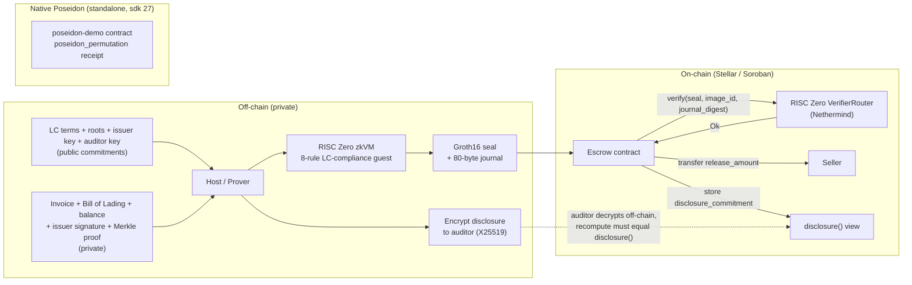
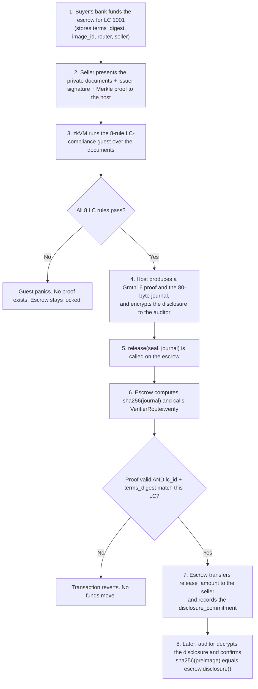

# Bill of Zero

Privacy-preserving Letter-of-Credit settlement on Stellar, powered by zero-knowledge proofs.

Bill of Zero lets a buyer's bank escrow a stablecoin payment for a Letter of Credit (LC) and release it to the seller the moment a compliant set of trade documents is presented, without ever revealing those documents on-chain. A RISC Zero zero-knowledge proof attests that a private invoice and bill of lading satisfy the LC's terms, that the documents are signed by a trusted issuer, that the seller is an approved exporter, and that the buyer is good for the credit line. A Soroban smart contract verifies that proof on Stellar and releases the funds. An auditor can later open a sealed disclosure and prove it matches exactly what settled.

---

## Problem statement

Letters of Credit underpin a large share of global trade. A bank pays the seller only after checking that the presented documents (commercial invoice, bill of lading, and others) comply with the terms of the LC. Two structural problems make this hard to bring on-chain:

1. Confidentiality versus verifiability. Trade documents contain sensitive commercial data: prices, counterparties, goods, and margins. Putting the settlement process on a public ledger for speed and automation would normally expose all of that data. Businesses will not publish their trade terms, so naive on-chain settlement is a non-starter.

2. Manual, centralized compliance checking. The document examination is slow (often days), manual, and concentrated in the issuing bank. There is no cheap, trust-minimized way for an automated system to confirm "these documents comply" without a human reading the documents.

Bill of Zero resolves the tension. The document check runs off-chain inside a zero-knowledge virtual machine, and only a succinct proof plus a minimal public summary (the LC id and the amount to release) is published. The chain learns that a compliant document set existed, not what was in it.

### What the chain never sees

- The documents themselves
- The goods description
- The exact shipment date
- The invoiced amount beyond the released figure
- The buyer's available balance (only that it covers the credit line)
- Which approved exporter the seller is

What is necessarily public: the LC id and the released amount, since funds move on a public ledger.

### How zero-knowledge is load-bearing

The escrow releases funds only if a Groth16 proof verifies on-chain. The proof attests, in zero knowledge, that all of the LC rules below hold. If any rule fails, the guest program panics and no proof can be produced, so non-compliant documents can never unlock the escrow. The proof is bound to the specific LC through a terms digest committed inside the journal and pinned in the escrow, and to the specific compliance program through the RISC Zero image id. Remove the zero-knowledge layer and there is no way to release funds while keeping documents private. It is not decorative.

### The eight compliance rules (all proven in zero knowledge)

1. Invoice amount is less than or equal to the LC credit limit.
2. Shipment date is on or before the LC deadline.
3. and 4. Both documents name the LC's buyer and the LC's seller.
5. The invoice and the bill of lading are mutually consistent.
6. Range proof: the buyer's escrow balance covers the LC credit line, without revealing the exact balance.
7. Merkle membership: the seller is on the bank's approved-exporter allowlist, without revealing which entry.
8. Issuer signature: the documents carry a valid ed25519 signature from the LC's trusted issuer, verified inside the zkVM.

---

## Architecture



---

## End-to-end flow (linear)



---

## Tech stack

| Layer | Technology |
| --- | --- |
| Zero-knowledge proving | RISC Zero zkVM 3.0.5 (STARK proof, wrapped to Groth16 over BN254) |
| In-guest crypto | ed25519-dalek (issuer signature verified inside the zkVM), SHA-256 (Merkle tree + commitments) |
| Proof encoding | risc0-ethereum-contracts (encode_seal), producing a selector-prefixed seal |
| On-chain verification | Nethermind RISC Zero VerifierRouter via the risc0-interface client; Stellar Protocol 25/26 BN254 and Poseidon host functions |
| Selective disclosure | X25519 ECDH + ChaCha20-Poly1305 (host side), blinded SHA-256 commitment (in journal) |
| Smart contracts | Soroban SDK 25.x (escrow), Soroban SDK 27 with hazmat-crypto (Poseidon demo), compiled to wasm32v1-none |
| Native primitive demo | Stellar Poseidon host function (Protocol 25, CAP-0075) via env.crypto_hazmat().poseidon_permutation |
| Blockchain | Stellar (testnet) |
| Settlement asset | Stellar stablecoin / Stellar Asset Contract (for example USDC) |
| Languages | Rust (guest, host, and contracts) |
| Tooling | Stellar CLI 27, rzup / cargo-risczero 3.0.5, Docker (for the STARK to SNARK step) |

---

## Repository layout

```text
bill-of-zero
├── core/                      Shared data model (no_std), used by guest and host
│   └── src/lib.rs             LcTerms, DocumentSet, Merkle proof, journal + disclosure packing
├── methods/
│   ├── build.rs               Compiles the guest to an ELF and computes the image id
│   ├── src/lib.rs             Exports LC_CHECK_ELF and LC_CHECK_ID
│   └── guest/
│       └── src/main.rs        The 8-rule LC-compliance program that gets proven
├── host/
│   └── src/main.rs            Loads documents, builds Merkle proof, signs as issuer, proves,
│                              encrypts the auditor disclosure; also the `audit` subcommand
├── contracts/
│   ├── escrow/
│   │   └── src/lib.rs         Soroban escrow: verifies the proof, releases funds,
│   │                          records the disclosure commitment (soroban-sdk 25)
│   └── poseidon-demo/
│       └── src/lib.rs         Standalone native-Poseidon settlement receipt (soroban-sdk 27)
├── sample_data/
│   ├── lc_terms.json          Public LC terms
│   ├── approved_sellers.json  The bank's approved-exporter allowlist (Merkle leaves)
│   ├── docs_valid.json        Compliant presentation (proof succeeds)
│   ├── docs_tampered.json     Amount over limit (guest panics, no proof)
│   └── disclosure.bin         Generated: the encrypted auditor disclosure
└── README.md
```

---

## How it works in detail

### The guest (the zero-knowledge program)

`methods/guest/src/main.rs` reads the public `LcTerms` and the private `DocumentSet`, enforces the eight compliance rules with assertions, and on success commits a journal. A failed assertion panics, which means no proof can be generated for a non-compliant presentation. The issuer ed25519 signature is verified inside the guest, and the seller's approved-exporter Merkle path is recomputed up to the LC's `approved_root`.

### The journal (80 bytes)

The guest commits a fixed 80-byte journal so the Soroban contract can parse it with plain slicing, with no zero-knowledge tooling required on-chain:

```text
[0..8]    lc_id                 little-endian u64
[8..16]   release_amount        little-endian u64
[16..48]  terms_digest          sha256 of the canonical LC terms (binds roots, issuer/auditor keys)
[48..80]  disclosure_commitment blinded sha256 of the documents (for the auditor)
```

### The host (the prover)

`host/src/main.rs` maps the JSON sample documents into the shared types, builds the approved-exporter Merkle tree and the seller's inclusion proof, signs the documents with the issuer key, runs the prover with `ProverOpts::groth16()`, encrypts the disclosure to the auditor's X25519 key, and prints the values the escrow needs: `image_id`, `terms_digest`, `disclosure_cmt`, `journal`, `journal_digest`, and the `seal`. The `audit` subcommand decrypts the disclosure and recomputes the commitment.

### The escrow contract

`contracts/escrow/src/lib.rs` is initialized against one LC, storing the expected `terms_digest`, the pinned guest `image_id`, the verifier router address, the settlement token, and the seller. On `release(seal, journal)` it:

1. Computes `sha256(journal)` and calls `RiscZeroVerifierRouterClient.verify(seal, image_id, journal_digest)`.
2. Parses the now-verified journal and checks that the `lc_id` and `terms_digest` match this escrow.
3. Transfers `release_amount` to the seller.
4. Records the `disclosure_commitment` so an auditor can later confirm an off-chain disclosure (`disclosure()` view).

### Selective disclosure (auditor view key)

The guest commits a blinded `disclosure_commitment` over the documents into the journal, so it is proven and settled on-chain. Off-chain, the host encrypts the matching preimage to the auditor's X25519 public key (ECDH + ChaCha20-Poly1305). The auditor decrypts it and recomputes `sha256(preimage)`; if it equals `escrow.disclosure()`, the auditor is assured the disclosed figures are exactly what settled. The chain still leaks nothing.

### Native Poseidon settlement receipt (standalone)

`contracts/poseidon-demo/src/lib.rs` demonstrates Stellar's native Poseidon host function (Protocol 25, CAP-0075) running on-chain, via `env.crypto_hazmat().poseidon_permutation(...)` on soroban-sdk 27 with the `hazmat-crypto` feature. It computes a Poseidon commitment over `(lc_id, release_amount)`.

This is a separate contract on purpose. The Poseidon host function is only exposed by soroban-sdk 27, while the escrow stays on soroban-sdk 25 to remain compatible with the Nethermind RISC Zero verifier client (which pins soroban-sdk 25). Keeping Poseidon separate means the load-bearing on-chain proof verification is never put at risk. Note also that BN254 is already load-bearing in the escrow path: the verifier router uses BN254 pairing checks to verify the Groth16 proof.

---

## Build

Prerequisites: Rust with the `wasm32v1-none` target, RISC Zero (`rzup` / `cargo-risczero`), the Stellar CLI, and Docker (for the Groth16 step). On Windows this runs inside WSL2.

```bash
# RISC Zero side: shared types, guest ELF, and host
cargo build

# Escrow contract to WASM
cd contracts/escrow && stellar contract build

# Native Poseidon demo (separate workspace)
cd contracts/poseidon-demo && cargo test && stellar contract build
```

## Run a real proof locally

Generating a real Groth16 proof requires Docker (the STARK to SNARK wrap runs in a container).

```bash
cargo run --bin host -- sample_data/lc_terms.json sample_data/docs_valid.json
```

The compliant set prints a seal beginning with the Groth16 selector `73c457ba` and writes `sample_data/disclosure.bin`. The tampered set panics in the guest and produces no proof:

```bash
cargo run --bin host -- sample_data/lc_terms.json sample_data/docs_tampered.json
# Guest panicked: invoice amount exceeds LC credit limit
```

Open the auditor disclosure and confirm it matches the on-chain commitment:

```bash
cargo run --bin host -- audit sample_data/disclosure.bin
# invoice amount / buyer balance / shipment date + disclosure_commitment
```

For fast logic iteration without Docker, prefix with `RISC0_DEV_MODE=1` (this produces a placeholder seal and is not a secure proof).

---

## Status

- Toolchain, scaffold, shared types, 8-rule guest, host, escrow, and Poseidon demo: complete and building.
- Logic validated in dev mode: compliant documents produce the expected 80-byte journal; tampered documents panic.
- Real Groth16 proof generated locally, with the correct on-chain seal selector `73c457ba`.
- Issuer ed25519 signature verified inside the zkVM; approved-exporter Merkle membership and buyer-balance range proof enforced in-guest.
- Selective disclosure verified: the decrypted auditor preimage reproduces the journal's `disclosure_commitment`.
- Native Poseidon host function executed on-chain in the demo contract's test (deterministic and input-binding).
- Next: deploy the Nethermind verifier stack and the escrow to Stellar testnet, then call `release` to settle on-chain.

---

## Security notes and limitations

- This is a hackathon prototype and is not audited.
- The issuer key, auditor key, and disclosure blinding in the host are deterministic TEST values for a reproducible demo. In production the issuer key belongs to the carrier or issuing bank, the auditor owns their key, the ephemeral key is freshly sampled per presentation, and the blinding is random.
- The Poseidon demo uses a minimal valid permutation instance (documented MDS values plus a small round-constant set) to exercise the native host function; a production deployment would use standardized Poseidon parameters via a vetted library such as `rs-soroban-poseidon`.
- The released amount is intentionally public, since the payment is observable on the ledger. All other commercial detail stays off-chain.

---

## References

- RISC Zero zkVM: https://dev.risczero.com
- Stellar ZK proofs: https://developers.stellar.org/docs/build/apps/zk
- Stellar Poseidon (soroban-sdk migration): https://docs.rs/soroban-sdk/latest/soroban_sdk/_migrating/v25_poseidon/index.html
- Stellar BN254 (soroban-sdk migration): https://docs.rs/soroban-sdk/latest/soroban_sdk/_migrating/v25_bn254/index.html
- CAP-0075 (Poseidon/Poseidon2): https://github.com/stellar/stellar-protocol/blob/master/core/cap-0075.md
- Stellar RISC Zero verifier writeup: https://stellar.org/blog/developers/risc-zero-verifier
- Nethermind Stellar RISC Zero verifier: https://github.com/NethermindEth/stellar-risc0-verifier
