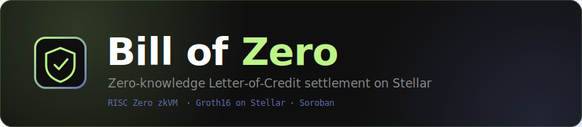
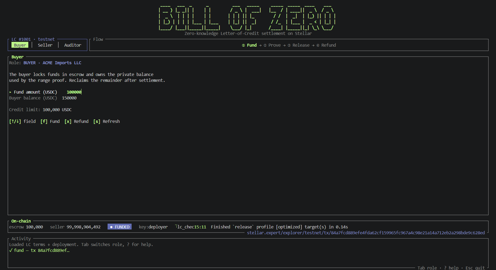
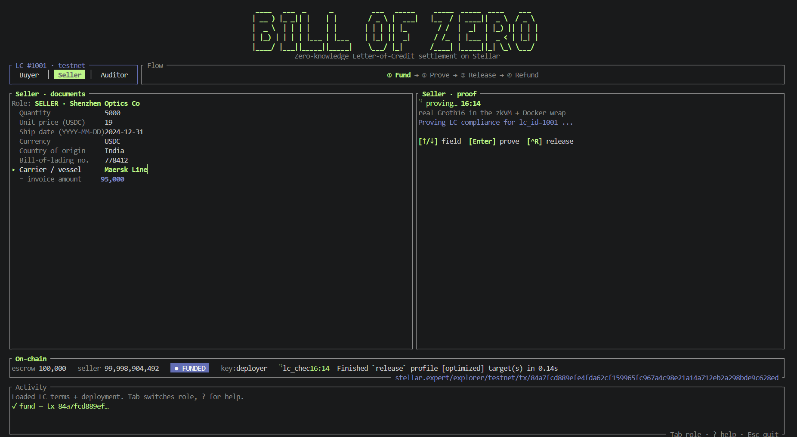
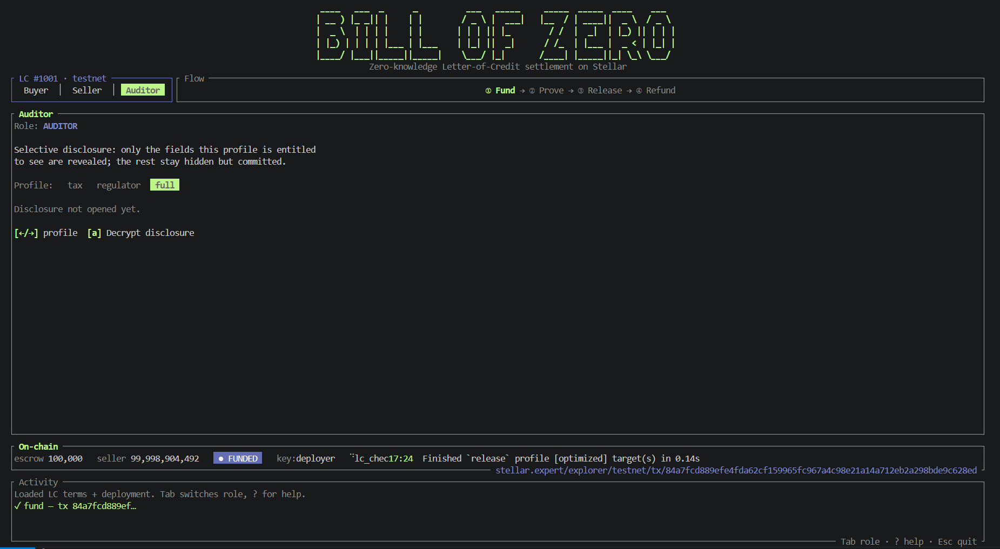
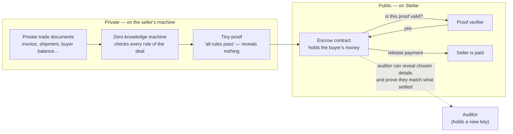
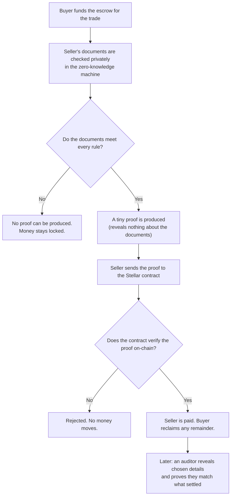

<p align="center">
  
</p>

<p align="center"><b>Privacy-preserving Letter-of-Credit settlement on Stellar, powered by zero-knowledge proofs.</b></p>

## What it is

Bill of Zero settles international trade payments **privately**. A buyer locks money in escrow; the seller gets paid the moment they prove their shipping documents meet the deal's terms — **without revealing the documents**. A smart contract on Stellar checks that proof and releases the money automatically, with no bank in the middle reading the paperwork.

It's a **Letter of Credit** (how banks finance global trade today) reimagined: the bank's slow, manual, days-long document check is replaced by a **zero-knowledge proof verified on-chain in seconds**, and the sensitive commercial details never become public.

## Proven live on Stellar testnet — verify it yourself

This is not a mockup. A real proof was generated and **verified inside the Stellar smart contract**, and real funds moved. Click any address to inspect it on Stellar Expert.

**The settlement transaction:** [`31e6198a…`](https://stellar.expert/explorer/testnet/tx/31e6198a7e6455b96f4605f13b686d90d1df68d6f1ce1c1afa28c97f441bdefe) — the escrow verified the zero-knowledge proof on-chain and transferred **95,000 to the seller**. Open it and you'll see the proof verification and the `transfer` event in one transaction.

| Contract / account | Address (Stellar testnet) |
| --- | --- |
| **Escrow** (holds funds, verifies the proof, releases) | [`CDVLQX43…SOXS3YE`](https://stellar.expert/explorer/testnet/contract/CDVLQX43SC3FVCLO42AZW34O5AK35CMQBGJRBEA7C6V6RPNTYSOXS3YE) |
| **Proof verifier router** (Nethermind RISC Zero) | [`CDA5J4P2…N5BTU`](https://stellar.expert/explorer/testnet/contract/CDA5J4P2VYDTBFZTDV6Y3YX3C3WKQGGCVQASOJW2FEN55DHRDGFN5BTU) |
| **Groth16 verifier** (selector `73c457ba`) | [`CCKHZZY5…VX6F`](https://stellar.expert/explorer/testnet/contract/CCKHZZY5S532BN33GBVTDXEHRRFC4BZYEYHC65WP73YDKPPGI4T6VX6F) |
| **Native Poseidon** (settlement receipt) | [`CDZHBSVG…BQ76Q`](https://stellar.expert/explorer/testnet/contract/CDZHBSVGGFAESS56FXKIJ4MMCSLITN5SYPNL4VZTAGLLDJXDNBQBQ76Q) |
| **Settlement token** (USDC-style SAC) | [`CDLZFC3S…GCYSC`](https://stellar.expert/explorer/testnet/contract/CDLZFC3SYJYDZT7K67VZ75HPJVIEUVNIXF47ZG2FB2RMQQVU2HHGCYSC) |
| **Seller** account (receives payment) | [`GDERZ3SX…S6YX`](https://stellar.expert/explorer/testnet/account/GDERZ3SXYJD74D54EDSCDDXZ7YC7TTNDXFRXN3MJFAG5P44DAUP2S6YX) |
| **Buyer** account (funds the escrow) | [`GB7AMGGO…4NTL`](https://stellar.expert/explorer/testnet/account/GB7AMGGO45LKOIUNIUIPMYFDIOC5NJP5TWYTQBEUQW7DOYG36IPH4NTL) |

Proof binding (committed in the journal, pinned in the escrow): guest `image_id` = `f3626281…ffb87421`, `terms_digest` = `ae47eeb6…600dacf4`. Full set in [`deployment.json`](deployment.json).

## How it works (plain language)

1. **Buyer funds the escrow.** Money is locked for one specific trade.
2. **Seller proves compliance, privately.** Their documents are checked against the deal's rules inside a "zero-knowledge machine." Out comes a tiny **proof** that says *"every rule passes"* — while revealing nothing about the documents. Non-compliant documents simply can't produce a proof.
3. **The contract verifies and pays.** The seller sends that proof to the Stellar contract. The contract checks it on-chain and, **only if it's valid**, releases the money to the seller. No valid proof → no payment.
4. **Auditors can peek, selectively.** A regulator holding a view key can later reveal *chosen* fields (say, just the amount) and prove they exactly match what settled — privacy **with** accountability.

---

## The example trade (what gets proved)

The demo settles one concrete Letter of Credit, **LC #1001**, between two parties:

**Buyer — ACME Imports LLC** (account [`GB7AMGGO…4NTL`](https://stellar.expert/explorer/testnet/account/GB7AMGGO45LKOIUNIUIPMYFDIOC5NJP5TWYTQBEUQW7DOYG36IPH4NTL)). Sets the terms of the credit and funds it.

| Buyer provides | Value | Public or private |
| --- | --- | --- |
| Credit limit | 100,000 USDC | public (the LC cap) |
| Shipment deadline | 2024-12-31 | public |
| Currency | USDC | public |
| Escrow funding | 100,000 | public (money on-chain) |
| Own account balance | 150,000 | **private** — only "≥ credit limit" is proved |

**Seller — Shenzhen Optics Co** (account [`GDERZ3SX…S6YX`](https://stellar.expert/explorer/testnet/account/GDERZ3SXYJD74D54EDSCDDXZ7YC7TTNDXFRXN3MJFAG5P44DAUP2S6YX)). Presents the shipping documents; gets paid when they prove compliance.

| Seller provides | Value | Public or private |
| --- | --- | --- |
| Quantity | 5,000 units | **private** |
| Unit price | 19 USDC | **private** |
| Invoice amount (= qty × price) | 95,000 | only the **released amount** is public |
| Shipment date | 2024-12-31 | **private** |
| Currency | USDC | **private** |
| Country of origin | China | **private** — only "on the allowed list" is proved |
| Bill-of-lading no. | 778412 | **private** (disclosed to auditor) |
| Carrier | Maersk Line | **private** (disclosed to auditor) |

The proof confirms all the rules below hold over these private values; on-chain, only **LC #1001** and the **released amount (95,000)** ever appear.

---

## Demo

Bill of Zero ships as a keyboard-driven terminal UI (ratatui). Three roles share one on-chain escrow: the **Buyer** funds it and reclaims any remainder, the **Seller** types the private trade documents, generates a real Groth16 proof and releases, and the **Auditor** selectively opens the sealed disclosure and verifies it matches what settled.

**Buyer — fund the escrow, refund the remainder**



**Seller — enter the documents, prove compliance, release**



**Auditor — selective disclosure with on-chain commitment match**



---

## Problem statement

Letters of Credit underpin a large share of global trade. A bank pays the seller only after checking that the presented documents (commercial invoice, bill of lading, and others) comply with the terms of the LC. Two structural problems make this hard to bring on-chain:

1. Confidentiality versus verifiability. Trade documents contain sensitive commercial data: prices, counterparties, goods, and margins. Putting the settlement process on a public ledger for speed and automation would normally expose all of that data. Businesses will not publish their trade terms, so naive on-chain settlement is a non-starter.

2. Manual, centralized compliance checking. The document examination is slow (often days), manual, and concentrated in the issuing bank. There is no cheap, trust-minimized way for an automated system to confirm "these documents comply" without a human reading the documents.

Bill of Zero resolves the tension. The document check runs off-chain inside a zero-knowledge virtual machine, and only a succinct proof plus a minimal public summary (the LC id and the amount to release) is published. The chain learns that a compliant document set existed, not what was in it.

### What the chain never sees

- The documents themselves
- The exact shipment date, quantity, unit price, and currency detail
- The invoiced amount beyond the released figure
- The buyer's available balance (only that it covers the credit line)
- Which approved exporter the seller is
- The goods' country of origin (only that it is on the allowed list)

What is necessarily public: the LC id and the released amount, since funds move on a public ledger.

### How zero-knowledge is load-bearing

The escrow releases funds only if a Groth16 proof verifies on-chain. The proof attests, in zero knowledge, that all of the LC rules below hold. If any rule fails, the guest program panics and no proof can be produced, so non-compliant documents can never unlock the escrow. The proof is bound to the specific LC through a terms digest committed inside the journal and pinned in the escrow, and to the specific compliance program through the RISC Zero image id. Remove the zero-knowledge layer and there is no way to release funds while keeping documents private. It is not decorative.

### The compliance rules (all proven in zero knowledge)

1. Invoice amount is less than or equal to the LC credit limit.
2. Invoice amount equals quantity × unit price (line-item integrity).
3. Invoice currency matches the LC currency.
4. Shipment date is on or before the LC deadline.
5. Both the invoice and the bill of lading name the LC's buyer and seller, and are mutually consistent.
6. Range proof: the buyer's balance covers the LC credit line, without revealing the exact balance.
7. Merkle membership: the seller is on the bank's approved-exporter allowlist, without revealing which entry.
8. Merkle membership: the goods' country of origin is on the LC's allowed-origin list, without revealing which.
9. Issuer signature: the documents carry a valid ed25519 signature from the LC's trusted issuer, verified inside the zkVM.

The bill-of-lading number and carrier are carried as disclosed-only fields (signed and auditable, not gated).

---

## Architecture



---

## End-to-end flow (linear)



---

## Tech stack

| Layer | Technology |
| --- | --- |
| Demo UI | Terminal UI in Rust (ratatui + crossterm); orchestrates the prover and the Stellar CLI |
| Zero-knowledge proving | RISC Zero zkVM 3.0.5 (STARK proof, wrapped to Groth16 over BN254) |
| In-guest crypto | ed25519-dalek (issuer signature verified inside the zkVM), SHA-256 (two Merkle trees + per-field commitments) |
| Proof encoding | risc0-ethereum-contracts (encode_seal), producing a selector-prefixed seal |
| On-chain verification | Nethermind RISC Zero VerifierRouter via the risc0-interface client; Stellar Protocol 25/26 BN254 and Poseidon host functions |
| Selective disclosure | X25519 ECDH + ChaCha20-Poly1305 (host side), per-field SHA-256 commitments combined into the journal commitment |
| Smart contracts | Soroban SDK 25.x (escrow: fund / release / refund), Soroban SDK 27 with hazmat-crypto (Poseidon demo), compiled to wasm32v1-none |
| Native primitive demo | Stellar Poseidon host function (Protocol 25, CAP-0075) via env.crypto_hazmat().poseidon_permutation |
| Blockchain | Stellar (testnet) |
| Settlement asset | Stellar stablecoin / Stellar Asset Contract (for example USDC) |
| Languages | Rust (guest, host, and contracts) |
| Tooling | Stellar CLI 27, rzup / cargo-risczero 3.0.5, Docker (for the STARK to SNARK step) |

---

## Repository layout

```text
bill-of-zero
├── core/                      Shared data model (no_std), used by guest and host
│   └── src/lib.rs             LcTerms, DocumentSet, Merkle proof, journal + disclosure packing
├── methods/
│   ├── build.rs               Compiles the guest to an ELF and computes the image id
│   ├── src/lib.rs             Exports LC_CHECK_ELF and LC_CHECK_ID
│   └── guest/
│       └── src/main.rs        The LC-compliance program that gets proven
├── host/
│   └── src/main.rs            Loads documents, builds Merkle proofs, signs as issuer, proves,
│                              encrypts the auditor disclosure; also the `audit` subcommand
├── tui/
│   └── src/                   Terminal UI (ratatui): Buyer / Seller / Auditor tabs;
│                              orchestrates the host prover and the Stellar CLI
├── contracts/
│   ├── escrow/
│   │   └── src/lib.rs         Soroban escrow: verifies the proof, releases funds, refunds the
│   │                          remainder, records the disclosure commitment (soroban-sdk 25)
│   └── poseidon-demo/
│       └── src/lib.rs         Standalone native-Poseidon settlement receipt (soroban-sdk 27)
├── sample_data/
│   ├── lc_terms.json          Public LC terms (credit limit, deadline, currency, parties)
│   ├── approved_sellers.json  The bank's approved-exporter allowlist (Merkle leaves)
│   ├── approved_origins.json  The bank's allowed-origin allowlist (Merkle leaves)
│   ├── docs_valid.json        Compliant presentation (proof succeeds)
│   ├── docs_tampered.json     Amount over limit (guest panics, no proof)
│   └── disclosure.bin         Generated: the encrypted auditor disclosure
├── deployment.json            Live testnet addresses + image id / terms digest
├── CLAUDE.md                  Fast setup / run guide for contributors and agents
└── README.md
```

---

## How it works in detail

### The guest (the zero-knowledge program)

`methods/guest/src/main.rs` reads the public `LcTerms` and the private `DocumentSet`, enforces the compliance rules with assertions, and on success commits a journal. A failed assertion panics, which means no proof can be generated for a non-compliant presentation. The issuer ed25519 signature is verified inside the guest, and the seller's approved-exporter and the goods' country-of-origin Merkle paths are recomputed up to the LC's `approved_root` and `origins_root`.

### The journal (80 bytes)

The guest commits a fixed 80-byte journal so the Soroban contract can parse it with plain slicing, with no zero-knowledge tooling required on-chain:

```text
[0..8]    lc_id                 little-endian u64
[8..16]   release_amount        little-endian u64
[16..48]  terms_digest          sha256 of the canonical LC terms (binds roots, issuer/auditor keys)
[48..80]  disclosure_commitment blinded sha256 of the documents (for the auditor)
```

### The host (the prover)

`host/src/main.rs` maps the JSON documents into the shared types, builds the approved-exporter and allowed-origin Merkle trees and their inclusion proofs, signs the documents with the issuer key, runs the prover with `ProverOpts::groth16()`, encrypts the per-field disclosure openings to the auditor's X25519 key, and prints the values the escrow needs: `image_id`, `terms_digest`, `disclosure_cmt`, `journal`, `journal_digest`, and the `seal`. The `audit <blob> [profile] [expected]` subcommand decrypts the openings, reveals only the fields the profile is entitled to, and verifies the recomputed commitment matches the on-chain value.

### The escrow contract

`contracts/escrow/src/lib.rs` is initialized against one LC, storing the expected `terms_digest`, the pinned guest `image_id`, the verifier router address, the settlement token, the seller, the buyer, and an expiry. On `release(seal, journal)` it:

1. Computes `sha256(journal)` and calls `RiscZeroVerifierRouterClient.verify(seal, image_id, journal_digest)`.
2. Parses the now-verified journal and checks that the `lc_id` and `terms_digest` match this escrow.
3. Checks the escrow holds enough to cover `release_amount`, marks the LC released before the external token call (effects-before-interactions, so it is reentrancy-safe), and transfers `release_amount` to the seller.
4. Records the `disclosure_commitment` so an auditor can later confirm an off-chain disclosure (`disclosure()` view).
5. Calls the Poseidon contract cross-contract to stamp a native-Poseidon settlement receipt over `(lc_id, release_amount)`, exposed via the `receipt()` view.

`refund()` lets the buyer reclaim the escrow's remaining balance after release, or cancel and reclaim the full balance once the LC has expired (so the seller keeps a fair presentation window until then).

### Selective disclosure (granular auditor view key)

Disclosure is per-field. Each document field gets its own commitment `c_i = sha256(i || value || blinding_i)`, with `blinding_i` derived from a master blinding, and the journal commits the overall `disclosure_commitment = sha256(c_0 || ... || c_n)`. Off-chain, the host encrypts the field openings to the auditor's X25519 public key (ECDH + ChaCha20-Poly1305). An auditor profile (for example `tax`, `regulator`, or `full`) reveals only the fields it is entitled to and recomputes the overall commitment from the openings; if it equals `escrow.disclosure()`, the disclosed figures are provably exactly what settled, while every other field stays hidden. The chain leaks nothing.

### Native Poseidon settlement receipt (integrated via cross-contract call)

`contracts/poseidon-demo/src/lib.rs` runs Stellar's native Poseidon host function (Protocol 25, CAP-0075) on-chain via `env.crypto_hazmat().poseidon_permutation(...)` (soroban-sdk 27, `hazmat-crypto`), computing a Poseidon commitment over `(lc_id, release_amount)`.

It lives in its own contract because the Poseidon host function is only exposed by soroban-sdk 27, while the escrow stays on soroban-sdk 25 to remain compatible with the Nethermind RISC Zero verifier client. The escrow integrates it **at settlement** with a cross-contract call: inside `release`, after the Groth16 proof verifies and funds transfer, the escrow calls the Poseidon contract to stamp a native-Poseidon settlement receipt and records it (the `receipt()` view). Each contract keeps its own SDK, so native Poseidon runs in the live settlement flow without putting the load-bearing proof verification at risk. BN254 is also load-bearing here: the verifier router uses BN254 pairing checks to verify the Groth16 proof.

---

## Build

Prerequisites: Rust with the `wasm32v1-none` target, RISC Zero (`rzup` / `cargo-risczero`), the Stellar CLI, and Docker (for the Groth16 step). On Windows this runs inside WSL2.

```bash
# RISC Zero side: shared types, guest ELF, host, and the TUI
cargo build --release

# Escrow contract to WASM
cd contracts/escrow && stellar contract build

# Native Poseidon demo (separate workspace)
cd contracts/poseidon-demo && cargo test && stellar contract build
```

## Run the demo (terminal UI)

The whole flow is driven from a terminal UI. Run it from the repo root; it reads the deployed addresses from `deployment.json` and signs on-chain calls with a local Stellar testnet key (`BZ_SOURCE_KEY`, default `deployer`).

```bash
cargo run -p bz-tui
```

`Tab` switches role. **Buyer:** fund the escrow (`f`), refund the remainder (`x`). **Seller:** type the documents, `Enter` to generate a real Groth16 proof, `Ctrl+R` to release. **Auditor:** pick a profile with `←/→`, `a` to decrypt and verify the commitment match. See `CLAUDE.md` for the full setup + keybindings.

## Run a proof from the CLI

Generating a real Groth16 proof requires Docker (the STARK to SNARK wrap runs in a container).

```bash
cargo run --release --bin host -- sample_data/lc_terms.json sample_data/docs_valid.json sample_data/approved_sellers.json
```

The compliant set prints a seal beginning with the Groth16 selector `73c457ba` and writes `sample_data/disclosure.bin`. The tampered set panics in the guest and produces no proof:

```bash
cargo run --release --bin host -- sample_data/lc_terms.json sample_data/docs_tampered.json sample_data/approved_sellers.json
# Guest panicked: invoice amount exceeds LC credit limit
```

Open the auditor disclosure for a given profile and verify it matches the on-chain commitment:

```bash
cargo run --release --bin host -- audit sample_data/disclosure.bin tax <escrow_disclosure_hex>
# reveals only the tax-profile fields; commitment match: yes
```

For fast logic iteration without Docker, prefix with `RISC0_DEV_MODE=1` (this produces a placeholder seal and is not a secure proof).

---

## Status

- **Deployed and proven end-to-end on Stellar testnet.** A real Groth16 proof is verified on-chain by the Nethermind RISC Zero VerifierRouter and the escrow releases funds to the seller.
- Full compliance guest (amount, line-item, currency, deadline, party consistency, range proof, approved-exporter and allowed-origin Merkle membership, issuer ed25519 signature), all enforced in-guest; tampered documents panic and produce no proof.
- Real Groth16 proof carries the correct on-chain seal selector `73c457ba`.
- Granular selective disclosure: per-field commitments let an auditor profile reveal only entitled fields and verify the recomputed commitment matches `escrow.disclosure()`.
- Escrow supports fund, release, and refund (remainder after release, or full cancellation after expiry).
- Terminal UI (ratatui) drives the Buyer / Seller / Auditor flow against the live testnet contracts.
- Native Poseidon host function executed on-chain in the demo contract's test (deterministic and input-binding).

---

## Security notes and limitations

- This is a hackathon prototype and is not audited.
- The issuer key, auditor key, and disclosure blinding in the host are deterministic TEST values for a reproducible demo. In production the issuer key belongs to the carrier or issuing bank, the auditor owns their key, the ephemeral key is freshly sampled per presentation, and the blinding is random.
- The Poseidon demo uses a minimal valid permutation instance (documented MDS values plus a small round-constant set) to exercise the native host function; a production deployment would use standardized Poseidon parameters via a vetted library such as `rs-soroban-poseidon`.
- The released amount is intentionally public, since the payment is observable on the ledger. All other commercial detail stays off-chain.

---

## References

- RISC Zero zkVM: https://dev.risczero.com
- Stellar ZK proofs: https://developers.stellar.org/docs/build/apps/zk
- Stellar Poseidon (soroban-sdk migration): https://docs.rs/soroban-sdk/latest/soroban_sdk/_migrating/v25_poseidon/index.html
- Stellar BN254 (soroban-sdk migration): https://docs.rs/soroban-sdk/latest/soroban_sdk/_migrating/v25_bn254/index.html
- CAP-0075 (Poseidon/Poseidon2): https://github.com/stellar/stellar-protocol/blob/master/core/cap-0075.md
- Stellar RISC Zero verifier writeup: https://stellar.org/blog/developers/risc-zero-verifier
- Nethermind Stellar RISC Zero verifier: https://github.com/NethermindEth/stellar-risc0-verifier
