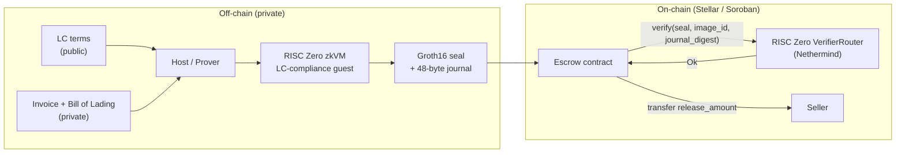
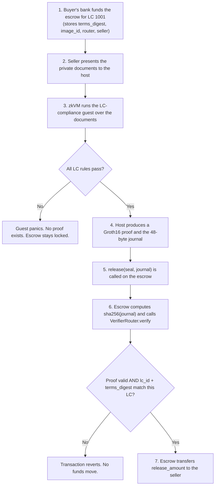

# Bill of Zero

Privacy-preserving Letter-of-Credit settlement on Stellar, powered by zero-knowledge proofs.

Bill of Zero lets a buyer's bank escrow a stablecoin payment for a Letter of Credit (LC) and release it to the seller the moment a compliant set of trade documents is presented, without ever revealing those documents on-chain. A RISC Zero zero-knowledge proof attests that a private invoice and bill of lading satisfy the LC's terms; a Soroban smart contract verifies that proof on Stellar and releases the funds.

---

## Problem statement

Letters of Credit underpin a large share of global trade. A bank pays the seller only after checking that the presented documents (commercial invoice, bill of lading, and others) comply with the terms of the LC. Two structural problems make this hard to bring on-chain:

1. Confidentiality versus verifiability. Trade documents contain sensitive commercial data: prices, counterparties, goods, and margins. Putting the settlement process on a public ledger for speed and automation would normally expose all of that data. Businesses will not publish their trade terms, so naive on-chain settlement is a non-starter.

2. Manual, centralized compliance checking. The document examination is slow (often days), manual, and concentrated in the issuing bank. There is no cheap, trust-minimized way for an automated system to confirm "these documents comply" without a human reading the documents.

Bill of Zero resolves the tension. The document check runs off-chain inside a zero-knowledge virtual machine, and only a succinct proof plus a minimal public summary (the LC id and the amount to release) is published. The chain learns that a compliant document set existed, not what was in it.

### What the chain never sees

- The documents themselves
- The goods description
- The exact shipment date
- The buyer and seller commercial relationship beyond the LC's own public terms

What is necessarily public: the LC id and the released amount, since funds move on a public ledger.

### How zero-knowledge is load-bearing

The escrow releases funds only if a Groth16 proof verifies on-chain. The proof attests, in zero knowledge, that:

- invoice amount is less than or equal to the LC credit limit
- shipment date is on or before the LC deadline
- both documents name the LC's buyer and the LC's seller
- the invoice and the bill of lading are mutually consistent

If any rule fails, the guest program panics and no proof can be produced, so non-compliant documents can never unlock the escrow. The proof is bound to the specific LC through a terms digest committed inside the journal and pinned in the escrow, and to the specific compliance program through the RISC Zero image id. Remove the zero-knowledge layer and there is no way to release funds while keeping documents private. It is not decorative.

---

## Architecture



---

## End-to-end flow (linear)



---

## Tech stack

| Layer | Technology |
| --- | --- |
| Zero-knowledge proving | RISC Zero zkVM 3.0.5 (STARK proof, wrapped to Groth16 over BN254) |
| Proof encoding | risc0-ethereum-contracts (encode_seal), producing a selector-prefixed seal |
| On-chain verification | Nethermind RISC Zero VerifierRouter via the risc0-interface client; Stellar Protocol 25/26 BN254 and Poseidon host functions |
| Smart contract | Soroban SDK 25.x, compiled from Rust to wasm32v1-none |
| Blockchain | Stellar (testnet) |
| Settlement asset | Stellar stablecoin / Stellar Asset Contract (for example USDC) |
| Languages | Rust (guest, host, and contract) |
| Tooling | Stellar CLI 27, rzup / cargo-risczero 3.0.5, Docker (for the STARK to SNARK step) |

---

## Repository layout

```text
bill-of-zero
├── core/                      Shared data model (no_std), used by guest and host
│   └── src/lib.rs             LcTerms, Invoice, BillOfLading, DocumentSet, journal packing
├── methods/
│   ├── build.rs               Compiles the guest to an ELF and computes the image id
│   ├── src/lib.rs             Exports LC_CHECK_ELF and LC_CHECK_ID
│   └── guest/
│       └── src/main.rs        The LC-compliance program that gets proven
├── host/
│   └── src/main.rs            Loads documents, proves, prints seal/journal/digests
├── contracts/
│   └── escrow/
│       └── src/lib.rs         Soroban escrow: verifies the proof, releases funds
├── sample_data/
│   ├── lc_terms.json          Public LC terms
│   ├── docs_valid.json        Compliant presentation (proof succeeds)
│   └── docs_tampered.json     Amount over limit (guest panics, no proof)
└── README.md
```

---

## How it works in detail

### The guest (the zero-knowledge program)

`methods/guest/src/main.rs` reads the public `LcTerms` and the private `DocumentSet`, enforces the five compliance rules with assertions, and on success commits a journal. A failed assertion panics, which means no proof can be generated for a non-compliant presentation.

### The journal (48 bytes)

The guest commits a fixed 48-byte journal so the Soroban contract can parse it with plain slicing, with no zero-knowledge tooling required on-chain:

```text
[0..8]    lc_id           little-endian u64
[8..16]   release_amount  little-endian u64
[16..48]  terms_digest    sha256 of the canonical LC terms
```

### The host (the prover)

`host/src/main.rs` maps the JSON sample documents into the shared types, runs the prover with `ProverOpts::groth16()`, and prints the values the escrow needs: `image_id`, `terms_digest`, `journal`, `journal_digest`, and the `seal`.

### The escrow contract

`contracts/escrow/src/lib.rs` is initialized against one LC, storing the expected `terms_digest`, the pinned guest `image_id`, the verifier router address, the settlement token, and the seller. On `release(seal, journal)` it:

1. Computes `sha256(journal)` and calls `RiscZeroVerifierRouterClient.verify(seal, image_id, journal_digest)`.
2. Parses the now-verified journal and checks that the `lc_id` and `terms_digest` match this escrow.
3. Transfers `release_amount` to the seller.

---

## Build

Prerequisites: Rust with the `wasm32v1-none` target, RISC Zero (`rzup` / `cargo-risczero`), the Stellar CLI, and Docker (for the Groth16 step). On Windows this runs inside WSL2.

```bash
# RISC Zero side: shared types, guest ELF, and host
cargo build

# Escrow contract to WASM
cd contracts/escrow && stellar contract build
```

## Run a real proof locally

Generating a real Groth16 proof requires Docker (the STARK to SNARK wrap runs in a container).

```bash
cargo run --bin host -- sample_data/lc_terms.json sample_data/docs_valid.json
```

The compliant set prints a seal beginning with the Groth16 selector `73c457ba`. The tampered set panics in the guest and produces no proof:

```bash
cargo run --bin host -- sample_data/lc_terms.json sample_data/docs_tampered.json
# Guest panicked: invoice amount exceeds LC credit limit
```

For fast logic iteration without Docker, prefix with `RISC0_DEV_MODE=1` (this produces a placeholder seal and is not a secure proof).

---

## Status

- Toolchain, scaffold, shared types, guest, host, and escrow contract: complete and building.
- Logic validated in dev mode: compliant documents produce the expected journal; tampered documents panic.
- Real Groth16 proof generated locally, with the correct on-chain seal selector `73c457ba`.
- Next: deploy the Nethermind verifier stack and the escrow to Stellar testnet, then call `release` to settle on-chain.

---

## Security notes and limitations

- This is a hackathon prototype and is not audited.
- v1 verifies that the documents satisfy the LC terms. It does not yet verify a digital signature from a document issuer; adding an issuer-signature check inside the guest is a planned extension.
- The released amount is intentionally public, since the payment is observable on the ledger. All other commercial detail stays off-chain.

---

## References

- RISC Zero zkVM: https://dev.risczero.com
- Stellar ZK proofs: https://developers.stellar.org/docs/build/apps/zk
- Stellar RISC Zero verifier writeup: https://stellar.org/blog/developers/risc-zero-verifier
- Nethermind Stellar RISC Zero verifier: https://github.com/NethermindEth/stellar-risc0-verifier
